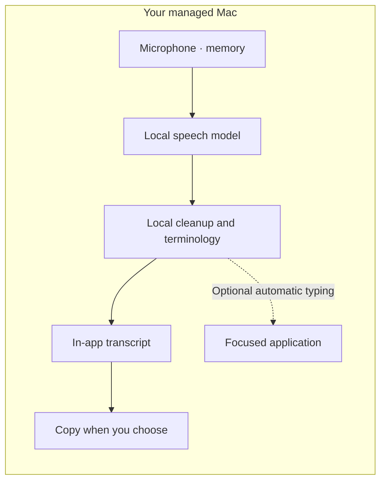

<p align="center">
  <a href="https://lockedinlabs.ai">
    <picture>
      <source media="(prefers-color-scheme: dark)" srcset="docs/brand/lockup-on-dark.svg">
      
    </picture>
  </a>
</p>

<h1 align="center">LockedIn Flow</h1>

<p align="center">
  <b>Private dictation for secure enterprise environments.</b><br>
  Your voice becomes polished text inside your managed Mac environment.
</p>

<p align="center">
  Offline after model setup · No external LLM · No runtime egress required · Free under MIT
</p>

<p align="center">
  <a href="docs/getting-started.md">Get started</a> ·
  <a href="docs/architecture.md">Architecture</a> ·
  <a href="docs/enterprise-evaluation.md">Enterprise evaluation</a> ·
  <a href="docs/project-standards.md">Engineering standards</a>
</p>

Engineering evidence: [AI-assisted SDLC](docs/secure-development.md) ·
[Third-party risk](docs/third-party-risk.md) · [Validation](docs/validation.md).

<p align="center">
  <a href="https://github.com/LockedinLabs-AI/lockedin-flow/actions/workflows/ci.yml"></a>
  <a href="https://github.com/LockedinLabs-AI/lockedin-flow/actions/workflows/security.yml"></a>
  <a href="LICENSE"></a>
  <a href="https://support.apple.com/macos"></a>
</p>

<p align="center">
  
</p>

<p align="center">
  
</p>

<p align="center"><em>Product views rendered from the application with synthetic example dictations.</em></p>

> [!IMPORTANT]
> v0.4.17/build 19 is a source release candidate, not a generally available
> binary. Source installation is available to developers. The signed download
> follows installed-app acceptance, model redistribution review, and notarization.
> See [release status and validation](docs/validation.md).

LockedIn Flow is a reviewable endpoint utility for managed Apple-silicon Macs.
It captures speech, transcribes it with an on-device model, cleans the text
locally, and shows a transcript you can copy. Automatic typing into another app
is an explicit opt-in; ordinary transcription needs no Accessibility access.
Microphone audio and
transcript text are not sent to a hosted transcription or large-language-model
service.

With verified models installed, core dictation requires no internet connection,
external LLM, or application egress. Each endpoint handles its own speech
workload; there is no shared transcription backend to provision. The destination
app may transmit the inserted text under its own policy.

Offline means you can turn off the network and dictate into a local editor after
setup. The speech models run on your device; they are third-party models, not
models trained or owned by LockedIn Labs. See the [model inventory and licenses](docs/model-licenses.md).



LockedIn Flow is MIT-licensed and free for individual, educational,
and commercial use. No license key, subscription, or per-seat fee is required.
Third-party dependencies and model artifacts retain their own license terms;
see [Dependency and model licenses](docs/model-licenses.md).

## Choose your path

Windows and Linux support is being built as a separate, real offline desktop
port with standard EXE/MSI and DEB/RPM/AppImage packaging. See the
[desktop source-evaluation guide](desktop/README.md) for its capabilities,
installation targets, and release gates. It is not yet a signed public download.

| Path | Intended use | Delivery | Status |
| --- | --- | --- | --- |
| LockedIn Flow download | Individual macOS use | Free signed and notarized download | Pending the release gates above |
| Source evaluation | Engineers reviewing or testing the current candidate | Clone, `npm ci --ignore-scripts --no-audit --no-fund`, `npm run doctor`, `npm run setup:local` | Available from source |
| Managed enterprise pilot | Controlled deployment on managed Macs | Signed PKG through mobile device management, pre-staged verified models, policy controls, and measured acceptance | Target delivery after release validation |

npm is the source-evaluation convenience layer, not the enterprise deployment
control plane. See [Enterprise evaluation](docs/enterprise-evaluation.md) for
the pilot topology, measures, and release boundary.

## The boundary

The desktop application exposes no model-acquisition flow and has no automatic
updater, telemetry client, inbound listener, or hosted inference adapter. The
linked FluidAudio dependency includes general-purpose model-hub code, so
LockedIn Flow forces that hub offline before every model load. Managed
deployments should also deny application egress.

A separate administrator or developer provisioner can retrieve speech models
from immutable Hugging Face revisions and accepts only the 39 files in the
reviewed SHA-256 manifest. An enterprise can instead pre-stage those files
through an approved deployment channel, then run the application with outbound
traffic blocked.

> [!NOTE]
> This architecture can reduce disclosure surface in privacy-sensitive and
> regulated workflows. It is not, by itself, a HIPAA, SOC 2, FedRAMP, or other
> compliance certification.

## Why this project exists

Cloud dictation can be appropriate when its service boundary is approved.
LockedIn Flow is for workflows where microphone audio and transcript text must
remain on the managed endpoint. It combines a narrow data path, no account for
the core workflow, no analytics SDK, local terminology rules with explicit CSV
import, and fail-closed handling for password fields and uncertain insertion
targets.

## Capabilities

- Apple-silicon Core ML speech recognition through FluidAudio and Parakeet models
- deterministic cleanup for punctuation, fillers, formatting, and spoken code
- optional contextual cleanup through Apple's on-device Foundation Models
- global shortcut and menu-bar workflow
- in-app transcription without Accessibility access or automatic clipboard changes
- optional Accessibility-based text insertion with a verified pasteboard fallback
- optional encrypted persistence for history and recovery; encrypted local vocabulary and snippets
- profile-scoped terminology import with quoted CSV, strict limits, local encrypted storage, and a [synthetic starter template](examples/terminology-template.csv)
- session-only dictation history by default, with configurable encrypted retention
- CycloneDX software bill of materials generation for packaged builds
- release-artifact verification and hardened-runtime deployment guidance

## Processing and storage boundary

| Stage | Location | Content leaves the Mac? |
| --- | --- | --- |
| Microphone capture | Process memory | No |
| Voice activity detection | On device | No |
| Speech recognition | Core ML / on device | No |
| Cleanup | Rules and optional Apple on-device model | No |
| Text insertion | macOS Accessibility API or verified pasteboard fallback | LockedIn Flow does not transmit it; the destination app may transmit or sync it immediately under its own policy |
| Explicit model provisioning | Separate source utility, or an administrator-controlled deployment channel | The utility does not require the desktop application to run; it sends no microphone or transcript content, and every received file is size- and SHA-256-verified before activation |
| Source release discovery | Manual GitHub visit | No background update request |

The application does not intentionally write raw microphone audio to disk. One
failed recording can remain in process memory for an explicit local retry and
is cleared on success, discard, replacement capture, or process exit.

Dictation History and Recovery are memory-only until quit by default. Users may
opt into encrypted persistent retention. Optional Meeting notes are encrypted
locally and remain until the user deletes them.

## Application requirements

- Apple silicon Mac
- macOS 15 or later
- Node.js 20 or later for the optional npm source-evaluation commands
- Microphone permission; Accessibility is optional for automatic typing into other apps
- approximately 484 MB for the default speech and voice-activity models

Base dictation runs on macOS 15. Optional Foundation Models cleanup,
translation, and Meeting notes require macOS 26 with Apple Intelligence
available and enabled.

## Fast local evaluation

The repository includes a zero-dependency npm convenience layer for developers.
There is no npm-registry package yet: npm in a clone initializes repository
tooling, and only the explicit `npm run setup:local` command builds, installs,
and provisions the application. It has no npm install lifecycle hooks, and Node
is not used by the installed app. The reproducible source-evaluation path is pinned to Xcode 26.6 build
17F113, Apple Swift 6.3.3, and the macOS 26.5 SDK. `npm run doctor` verifies
those exact versions before setup changes the machine.

```bash
git clone https://github.com/LockedinLabs-AI/lockedin-flow.git
cd lockedin-flow
npm ci --ignore-scripts --no-audit --no-fund
npm run doctor
npm run setup:local
```

`setup:local` explicitly builds and installs the ad-hoc-signed LockedIn Flow app in
`~/Applications`, then retrieves and verifies the default pinned model set. It
does not hide model acquisition inside `npm install`. Existing applications are
never overwritten unless the user passes `--replace`; the previous bundle is
preserved as a timestamped backup.

Add `-- --launch` to open the app only after provisioning completes. The same
setup command accepts `--replace`, `--repair`, and `--all` for an existing app,
an invalid model tree, or the optional English Precision model respectively.

If an existing model fails verification, the provisioner leaves it untouched
unless the user explicitly runs `npm run provision:models -- --repair`. Repair
stages and verifies the complete replacement before the old directory is
atomically displaced, and the next run recovers interrupted transactions.

Build and test the Swift source directly when preferred:

```bash
swift build --force-resolved-versions
swift test --force-resolved-versions
```

An unsigned, no-script component PKG can be created to exercise the managed
installation shape without presenting it as a production artifact:

```bash
npm run package:pkg
```

The LockedIn Flow bundle is ad-hoc signed for local evaluation and uses its own
bundle identifier, preferences domain, Application Support directory, and
Keychain service. It contains no updater and can be evaluated without touching a
separately installed build. An official downloadable artifact will be Developer ID signed,
notarized, and published only after installed acceptance testing.

For managed deployment, npm is not the production installer. Use a signed and
notarized PKG through MDM, pre-stage the verified models, apply the approved
Privacy Preferences Policy Control profile, then enforce the network boundary.
See [Enterprise adoption](docs/enterprise-adoption.md) and
[Managed deployment](docs/managed-deployment.md).

## Current status

The initial LockedIn Flow release candidate is based on v0.4.17/build 19 source. It
includes a focused-target stability change for renderer-driven editors such as
Codex and Claude: delivery uses bounded coherent observations of the current
focused editor instead of synchronously scanning an entire changing
Accessibility tree.
Microphone capture no longer retains a concrete Accessibility field across the
recording. The destination application is frozen when recording ends, and the
current non-secure text field is resolved only at delivery. Secure fields,
application changes during processing, and unresolved target churn fail closed.

No official LockedIn Flow binary is published from this repository yet. The first
artifact remains withheld until the v0.4.17 source passes repeated installed
record-to-exactly-once acceptance. Source readiness is not presented as
installed-product acceptance. See [CHANGELOG.md](CHANGELOG.md) and
[docs/release-process.md](docs/release-process.md).

## Architecture and security

- [Architecture](docs/architecture.md)
- [Security and data flow](docs/security.md)
- [Threat model](docs/threat-model.md)
- [Dependency and model licenses](docs/model-licenses.md)
- [Managed deployment](docs/managed-deployment.md)
- [Enterprise adoption and product boundary](docs/enterprise-adoption.md)
- [Enterprise evaluation and pilot scorecard](docs/enterprise-evaluation.md)
- [Engineering and publication standards](docs/project-standards.md)
- [Product engineering contract](docs/project-standards.md#product-engineering-contract)
- [Validation evidence](docs/validation.md)
- [Compatibility status](docs/compatibility.md)
- [Security reporting](SECURITY.md)

## Project layout

```text
Sources/
  LockedInFlowApp/    SwiftUI menu-bar application and pipeline orchestration
  VoiceCore/          local stores, policy, types, retention, and recovery
  AudioCapture/       microphone capture and recovery
  SpeechEngine/       on-device recognition and voice activity detection
  TextIntelligence/   deterministic and on-device cleanup
  InsertionEngine/    safe current-target verification and text delivery
Tests/                unit, policy, and regression tests
scripts/              local build, SBOM, and artifact checks
docs/                 architecture, security, and release boundaries
```

## Contributing and support

Read [CONTRIBUTING.md](CONTRIBUTING.md) before opening a pull request. Use only
synthetic data in issues, tests, screenshots, and logs. Report vulnerabilities
privately according to [SECURITY.md](SECURITY.md).

Community support is described in [SUPPORT.md](SUPPORT.md). Managed deployment,
maintenance, and enterprise integration services can be discussed through
[LockedIn Labs](https://lockedinlabs.ai/).

The Swift modules are pre-1.0 implementation details, not a supported SDK or
stable enterprise integration API. The supported product boundary is the macOS
application and its documented managed-package workflow.

## License and marks

The source code is licensed under the [MIT License](LICENSE) and is free for
individual and commercial use. See [NOTICE](NOTICE) for attribution. Product
names, logos, and other brand assets are not granted under the MIT License; see
[TRADEMARKS.md](TRADEMARKS.md).
