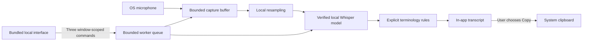

# Desktop architecture

The shared Rust core is independent of the webview, microphone driver, clipboard,
and speech backend. Enterprise integrations should use this core, not copy a
second state machine into a portal or agent framework.

| Module | Responsibility | Must not own |
| --- | --- | --- |
| `core` | Session transitions, generation validation, capture bounds, terminology | UI, network, disk persistence, device drivers |
| `engine` | Audio adapter, resampling, model verification, CPU inference | Webview commands, credentials, remote model acquisition |
| `app` | Window authorization, bounded queue, recovery ownership, clipboard adapter | Arbitrary file paths, shell execution, remote service clients |
| `ui` | Presentation and explicit user actions | Direct filesystem, microphone, clipboard, or network authority |
| `scripts` | Build-time model acquisition, inventory, source verification, packaging | Runtime transcription |

The worker owns the input stream. It serializes capture and inference, rejects
overlapping recordings, and leaves the previous successful transcript visible
until a new one completes. Recognition failure retains the captured audio for
explicit retry; discard drops that audio without changing the clipboard. A
device interruption transcribes the captured portion and labels it as partial.
A monotonic watchdog closes streams that deliver no new samples for five
seconds, including streams that never report an explicit driver error. It
preserves any captured portion; an empty capture returns to Ready without
discarding the previous transcript. An empty recognition result retains the
audio for recovery instead of replacing that transcript with blank text.

Raw device-rate audio is bounded to five minutes, downmixed, and resampled to
16 kHz before recognition. The model loader verifies the bytes it actually
passes to the decoder, avoiding a separate verify-then-reopen race. It accepts
only the bundled model name and digest, never an arbitrary path from the UI.

The renderer can invoke only `get_status`, `perform_action`, and
`set_vocabulary`, scoped to the local main window. No remote origins receive
capabilities. Navigation is limited to the platform's bundled application
origin, not arbitrary websites or local files. A restrictive content policy, no remote fonts/assets, no dynamic
HTML insertion, no plugins exposing shell/filesystem/HTTP, and fixed error
messages reduce the bridge's attack surface.

There is no shared speech backend or tenant database. Scaling means deploying
and maintaining independent endpoints, not a claim of zero deployment cost.
The current transcript interface is internal and versioned with the app; no
public remote API or unauthenticated localhost listener is exposed.
