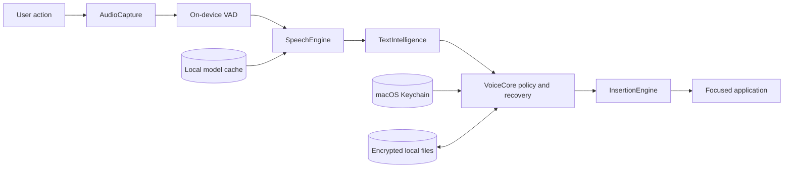

# Architecture

LockedIn Flow is a modular Swift Package Manager workspace. The application
shell coordinates independently testable libraries for capture, recognition,
cleanup, storage policy, and text delivery.

## Modules

| Module | Responsibility | Must not do |
| --- | --- | --- |
| `AudioCapture` | microphone graph, sample conversion, recovery | persist or transmit audio |
| `SpeechEngine` | locate and verify provisioned models, then run on-device speech recognition and edge VAD | acquire a model or call a hosted transcription API |
| `TextIntelligence` | deterministic cleanup and optional Apple on-device cleanup | use tools, remote prompts, or external context |
| `VoiceCore` | types, retention, encrypted stores, and recovery policy | depend on application UI |
| `InsertionEngine` | resolve and revalidate the current safe target, then deliver at most once | inspect arbitrary screen content or insert into a secure field |
| `LockedInFlowApp` | SwiftUI/AppKit shell and pipeline orchestration | duplicate core policy |

## Dictation sequence

1. An explicit shortcut or microphone control begins a capture attempt.
2. Microphone permission is required. The default in-app mode needs no
   Accessibility access. Automatic insertion is an explicit opt-in with a
   separate, clearly explained permission request from the correctly named app
   bundle. Recording never raises an Accessibility prompt.
3. Audio is converted to 16 kHz mono samples in memory.
4. Optional on-device voice activity detection trims only leading and trailing
   non-speech. Detector failure falls back to the original samples.
5. A local Parakeet model transcribes the samples.
6. Deterministic cleanup runs. On supported systems, the user can explicitly
   enable an Apple on-device contextual pass; it is off by default.
7. The delivery mode is frozen when capture begins and retained for retries.
   In-app mode displays the transcript without inspecting a destination,
   executing cross-app spoken commands, or automatically writing the clipboard.
   In automatic-insertion mode, recording end freezes the destination application
   identity and activation generation, but not a concrete text field.
8. Recovery text follows the configured retention policy after a completed
   delivery attempt: memory-only by default, or encrypted locally when the user
   opts into persistence.
9. For automatic insertion only, `InsertionEngine` resolves the currently focused editable field
   in the frozen application, refuses secure fields, and uses an Accessibility
   write or a verified pasteboard transaction.
10. A delivery is reported successful only when the post-write evidence matches
   the expected exact result. Ambiguous outcomes are never retried blindly.

## Dynamic editor target model

Renderer-driven editors may replace Accessibility nodes while preserving the
same logical composer. LockedIn Flow does not retain one of those nodes across
recording. When recording ends, it freezes:

- target process and bundle identity;
- activation generation; and
- the formatting profile selected for the dictation.

After local processing completes, the delivery boundary obtains coherent,
content-free observations of the currently focused field in that application:
native window, text capability, secure-field state, normalized semantic path,
and selected range. Transient renderer remounts receive bounded retries without
a full-window tree scan. A changed application, secure state, unresolved churn,
or unverified delivery is rejected. Protected workflows remain strict
exact-control operations. The user must keep the intended editor focused until
insertion completes; changing fields within the same application intentionally
changes the current delivery field.

## Storage

Application data lives under the current macOS user's Application Support
directory. When persisted, transcript history, recovery text, vocabulary, and
snippets use AES-GCM with a key stored in macOS Keychain using a device-bound
accessibility class. Session-only History and Recovery remain in process memory.

## Network adapters

LockedIn Flow has no remote inference adapter, app-owned model-acquisition flow,
automatic updater, telemetry client, or inbound listener. `SpeechEngine` accepts
only a locally provisioned model directory whose exact files, sizes, and hashes
match the compiled manifest. The linked FluidAudio dependency retains
general-purpose model-hub code, so that hub is forced offline before loading.

The repository's explicit provisioning utility is outside the application
runtime. It can acquire immutable artifacts for source evaluation, or an
administrator can stage the same reviewed tree through MDM. The production
boundary is enforced by pre-provisioning and endpoint network policy, not by a
claim that a non-sandboxed executable is incapable of networking.

## Concurrency boundary

Application state and orchestration are main-actor isolated. Speech providers
are actors, inference does not block the UI actor, and audio callbacks remain
off-main. Recovery and persistence components serialize their writes.
