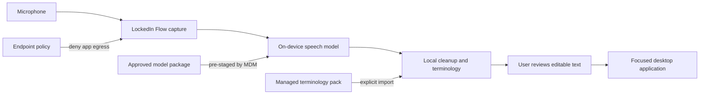
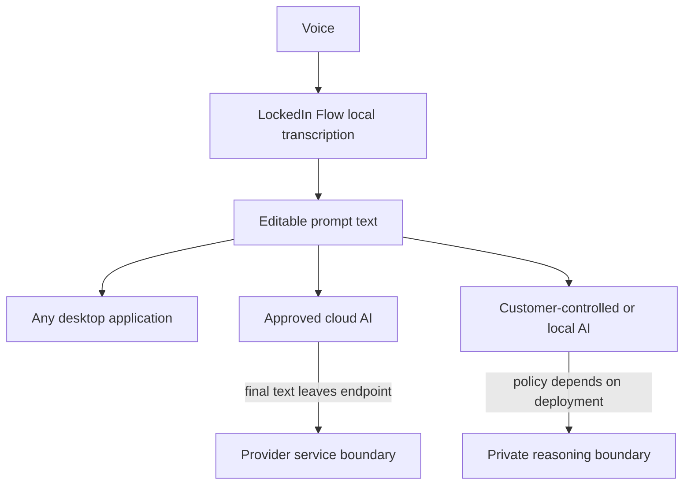

# Enterprise evaluation

LockedIn Flow is intended to be a small endpoint capability, not another AI
platform. Its enterprise value is a narrow, enforceable boundary: convert voice
to editable text on a managed Mac without sending microphone audio or transcript
content to a transcription service.

The current v0.4.17/build 19 source is suitable for technical review and a
controlled evaluation. It is not yet a generally available enterprise release.
See [Release process](release-process.md) for the remaining promotion gates.

## Reference deployment

The application process opens no inbound listener and does not acquire models,
check for updates, send telemetry, or call a hosted inference service. An
administrator distributes the signed application and reviewed model packages
through the organization's existing endpoint-management channel. The separate
source-evaluation provisioner can retrieve pinned models for a developer, but
it is not required in the managed deployment.

## What a pilot should prove

A pilot should use a bounded group of managed Apple-silicon Macs and
representative target applications. Record both successful and refused
dictations; a safe refusal is not the same failure as lost or duplicated text.

| Measure | Evidence |
| --- | --- |
| Delivery reliability | Successful insertions, safe refusals, duplicate insertions, and recoverable-text events by target application |
| Recognition quality | Word error rate on an approved synthetic or non-sensitive corpus, plus terminology accuracy for names and domain terms |
| Responsiveness | p50 and p95 release-to-text latency for short, medium, and long dictations |
| Recovery | Microphone route change, interruption, sleep/wake, focus movement, renderer replacement, and app restart cases |
| Network boundary | Packet-capture or endpoint-firewall evidence with verified models pre-staged and application egress denied |
| Endpoint cost | CPU, memory, battery, thermal behavior, model-load time, and package footprint on supported hardware |
| Operations | Install, upgrade, rollback, removal, permission repair, and content-free diagnostic collection through the supported MDM path |

No reliability percentage should be published until the workload, denominator,
hardware, operating-system version, and target-application matrix are published
with it.

## Terminology without directory overreach

LockedIn Flow supports local spoken-to-written terminology rules scoped to
General, Email, Chat, or Coding profiles. For a pilot, export only the fields
needed for recognition: approved display names, acronyms, product terms, and
explicit “heard as” aliases. Do not export email addresses, employee IDs,
reporting relationships, phone numbers, or an entire corporate directory.

The current LockedIn Flow workflow is an explicit, bounded CSV import encrypted in
the user's local store. A managed terminology service remains roadmap work and
should add signed, versioned, anti-rollback packs; separate managed and personal
rules; policy enforcement; last-known-good recovery; and key rotation.

## Voice input and the downstream AI boundary

LockedIn Flow is an input layer, not a reasoning model. It can improve the
prompt before submission by applying local terminology, punctuation, formatting,
and code-oriented rules. It does not make an external AI service local.

An application embedding this capability should label the full path clearly:

- **Local voice mode:** speech conversion remains on the endpoint.
- **Private AI mode:** speech and reasoning both use customer-controlled
  infrastructure.
- **Approved cloud-agent mode:** speech conversion is local, then the reviewed
  transcript is sent to the selected provider.

If the downstream model is unavailable, LockedIn Flow can still preserve and
edit the transcript locally; it cannot complete the model's reasoning task.
For an embedded macOS integration, prefer a narrow XPC interface for start,
stop, cancel, transcript result, and content-free error state rather than a new
HTTP listener.

## Commercial boundary

LockedIn Flow is free for individual and commercial use.
Enterprise value should come from operating assurance rather than restricting
the open-source license:

- signed long-term-support releases and compatibility validation;
- managed app, model, policy, and terminology packaging;
- deployment and rollback support for enterprise MDM;
- security maintenance, incident response, and defined support targets;
- private integrations and customer-specific acceptance evidence; and
- independent assessment support and procurement documentation.

## Promotion gates

Before calling a build enterprise-ready or generally available:

1. complete repeated installed record-to-exactly-once acceptance across the
   published application matrix;
2. validate microphone recovery on affected hardware and operating-system
   versions;
3. resolve redistribution rights for every packaged model artifact;
4. sign, notarize, and staple the app, DMG, and enterprise PKG from the exact
   reviewed source revision;
5. validate MDM install, upgrade, rollback, removal, Privacy Preferences Policy
   Control, and egress-denial procedures;
6. publish the exact-artifact SBOM, provenance, checksums, compatibility matrix,
   and known limitations;
7. run CodeQL, dependency review, secret scanning, and the complete CI gate in
   the public repository; and
8. complete an independent security and runtime-network review.

These gates separate a credible controlled pilot from a production claim.
